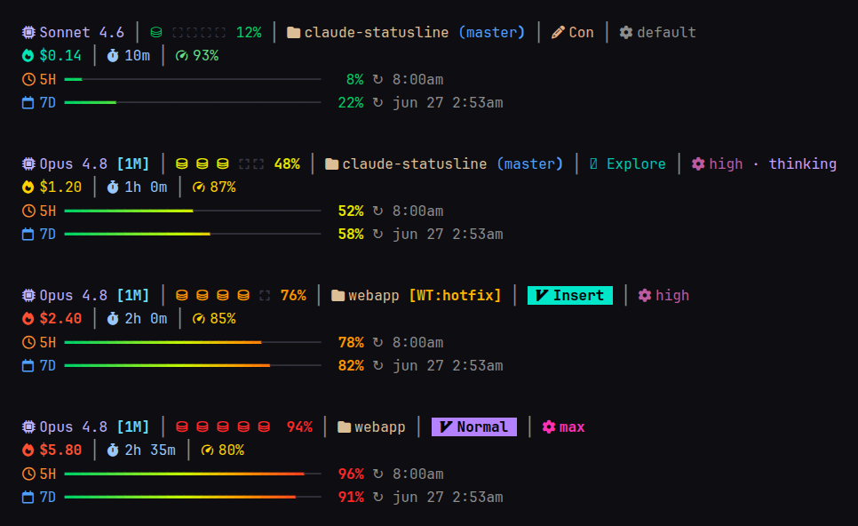

# Claude Code Statusline

A two-line, truecolor statusline for [Claude Code](https://docs.claude.com/en/docs/claude-code) — model, context meter, git state, cost, cache hit rate and rate-limit bars, with an optional cross-compaction progress task bar.

一個給 Claude Code 用的雙行 truecolor 狀態列 —— 顯示 model、context 用量、git 狀態、花費、cache 命中率與 rate-limit 進度條，並可選配跨壓縮的進度任務列。



> 截圖待補：把一張實際終端機畫面放到 `assets/screenshot.png`。
> Screenshot pending: drop a real terminal capture at `assets/screenshot.png`.

`繁體中文` ↓ ｜ [English](#english)

---

## 繁體中文

### 這是什麼

Claude Code 允許你用一個吃 stdin JSON、吐 stdout 文字的指令客製狀態列。本腳本就是那個指令：把 Claude Code 餵進來的 session JSON 渲染成兩行（含選配的第三行任務列）資訊密度高的狀態列。

### 顯示內容

**第 1 行**
- Model 名稱，超過 200k context 時加上 `[1M]` 徽章
- Context meter（5 格圖示，每格 20%）+ 百分比，顏色隨用量由綠轉紅
- 當前目錄名 + git branch（dirty 時加 `*`）
- Worktree 標記 `[WT]` / `[WT:<name>]`
- Vim mode、output style 縮寫、subagent 名稱
- Effort 等級（max/high 變色）、thinking 開關指示

**第 2 行**
- 本次 session 花費 + 當週累計（`~/.claude/cost-ledger` 紀錄）
- Session 經過時間、最近一次 API 呼叫的 cache 命中率
- 5H / 7D rate-limit 漸層進度條 + reset 時間

**選配的第 0 行（任務列）**：見下方 [Progress 任務列](#選配progress-任務列)。

### 需求

| 項目 | 說明 |
|---|---|
| **bash ≥ 5.0** | 用到 `EPOCHSECONDS`。⚠️ macOS 內建 bash 為 3.2，請 `brew install bash` 並確認在 PATH 最前面 |
| **jq** | 解析 stdin JSON 的核心依賴 |
| **Nerd Font** | 所有 icon 需要（[nerdfonts.com](https://www.nerdfonts.com/)） |
| **truecolor 終端機** | 24-bit 色彩；多數現代終端機（Ghostty、kitty、WezTerm、現代 tmux）皆支援 |

### 安裝

**方式一：腳本**

```bash
git clone <this-repo> claude-statusline
cd claude-statusline
./install.sh   # 複製檔案到 ~/.claude/，並印出要 merge 的 settings.json 片段
```

**方式二：手動**

```bash
cp statusline.sh ~/.claude/statusline.sh
chmod +x ~/.claude/statusline.sh
```

接著把這段 merge 進 `~/.claude/settings.json`：

```json
{
  "statusLine": {
    "type": "command",
    "command": "bash \"$HOME/.claude/statusline.sh\""
  }
}
```

### 選配：Progress 任務列

`inject-progress.sh` 是一個 `SessionStart` hook，與狀態列搭配可在最上方多顯示一行「📋 當前任務 ｜ phase」。**不裝它狀態列照常運作**——任務列只是維持隱藏不佔位。

運作方式：hook 每次 session 開始/壓縮/resume 時，會把一個 per-session 的進度檔路徑 `<cwd>/.progress/<session_id>/INDEX.md` 注入給模型，並請模型主動維護它。狀態列再讀這個 `INDEX.md` 的前兩行（`# <任務>` 與 `phase: <N>`）渲染出來。壓縮後 hook 會把 INDEX 內容回灌，等於一個跨壓縮的記憶錨。

安裝：

```bash
mkdir -p ~/.claude/hooks
cp inject-progress.sh ~/.claude/hooks/inject-progress.sh
chmod +x ~/.claude/hooks/inject-progress.sh
```

把這段 merge 進 `~/.claude/settings.json`：

```json
{
  "hooks": {
    "SessionStart": [
      { "hooks": [ { "type": "command", "command": "bash ~/.claude/hooks/inject-progress.sh" } ] }
    ]
  }
}
```

`INDEX.md` 格式（模型自行維護，你不必手寫）：

```markdown
# 一句話描述當前任務
phase: 2
（之後接 現狀 / 下一步 / 卡點…，精簡 <2KB）
```

### 它會在你家目錄寫哪些檔案

- `~/.claude/cost-ledger`：當週各 session 花費的彙總（純文字，自動建立/清理）
- `$XDG_RUNTIME_DIR/statusline-git-*`（無 XDG_RUNTIME_DIR 時退回 `/tmp`）：git 狀態快取，TTL 10 秒，避免每次刷新都跑 git

### 輸入契約

Claude Code 會把一份 session JSON 從 stdin 餵進腳本，欄位包含 `model`、`context_window`、`workspace`、`cost`、`rate_limits`、`vim`、`agent` 等。想改顯示內容，直接看 `statusline.sh` 開頭的 `jq` 區塊（約 L150）即知有哪些欄位可用。

### 來源

從個人 dotfiles 抽出後做了去個人化與跨平台處理。歡迎自由修改。

### 授權

[MIT](LICENSE)

---

## English

### What it is

Claude Code lets you customize the statusline with a command that reads session JSON on stdin and prints text on stdout. This script is that command: it renders the session JSON Claude Code feeds it into a dense two-line statusline (plus an optional third task row).

### What it shows

**Line 1**
- Model name, with a `[1M]` badge when the context window exceeds 200k
- Context meter (5 glyphs, 20% each) + percentage, green→red by usage
- Current directory + git branch (with `*` when dirty)
- Worktree marker `[WT]` / `[WT:<name>]`
- Vim mode, output-style abbreviation, subagent name
- Effort level (max/high are colored), thinking on/off indicator

**Line 2**
- This session's cost + weekly total (tracked in `~/.claude/cost-ledger`)
- Session elapsed time, and cache-hit ratio of the most recent API call
- 5H / 7D rate-limit gradient bars + reset times

**Optional line 0 (task bar):** see [Progress task bar](#optional-progress-task-bar).

### Requirements

| Item | Notes |
|---|---|
| **bash ≥ 5.0** | Uses `EPOCHSECONDS`. ⚠️ macOS ships bash 3.2 — `brew install bash` and put it first on PATH |
| **jq** | Core dependency for parsing the stdin JSON |
| **Nerd Font** | Needed for every icon ([nerdfonts.com](https://www.nerdfonts.com/)) |
| **truecolor terminal** | 24-bit color; most modern terminals (Ghostty, kitty, WezTerm, modern tmux) qualify |

### Install

**Option A — script**

```bash
git clone <this-repo> claude-statusline
cd claude-statusline
./install.sh   # copies files into ~/.claude/ and prints the settings.json snippets to merge
```

**Option B — manual**

```bash
cp statusline.sh ~/.claude/statusline.sh
chmod +x ~/.claude/statusline.sh
```

Then merge this into `~/.claude/settings.json`:

```json
{
  "statusLine": {
    "type": "command",
    "command": "bash \"$HOME/.claude/statusline.sh\""
  }
}
```

### Optional: Progress task bar

`inject-progress.sh` is a `SessionStart` hook that, paired with the statusline, adds a leading row: "📋 current task ｜ phase". **The statusline works fine without it** — the task row simply stays hidden.

How it works: on every session start / compaction / resume, the hook injects a per-session progress-file path `<cwd>/.progress/<session_id>/INDEX.md` to the model and asks it to maintain that file. The statusline then reads the first two lines of `INDEX.md` (`# <task>` and `phase: <N>`) and renders them. After a compaction the hook re-injects the INDEX content, making it a cross-compaction memory anchor.

Install:

```bash
mkdir -p ~/.claude/hooks
cp inject-progress.sh ~/.claude/hooks/inject-progress.sh
chmod +x ~/.claude/hooks/inject-progress.sh
```

Merge this into `~/.claude/settings.json`:

```json
{
  "hooks": {
    "SessionStart": [
      { "hooks": [ { "type": "command", "command": "bash ~/.claude/hooks/inject-progress.sh" } ] }
    ]
  }
}
```

`INDEX.md` format (maintained by the model — you don't write it by hand):

```markdown
# one-line description of the current task
phase: 2
(then current-state / next-step / blockers…, kept under 2KB)
```

### Files it writes under your home

- `~/.claude/cost-ledger`: weekly per-session cost ledger (plain text, auto-created/pruned)
- `$XDG_RUNTIME_DIR/statusline-git-*` (falls back to `/tmp`): git-state cache, 10s TTL, so git isn't run on every refresh

### Input contract

Claude Code pipes a session JSON document into the script on stdin, with fields such as `model`, `context_window`, `workspace`, `cost`, `rate_limits`, `vim`, and `agent`. To change what's displayed, read the `jq` block near the top of `statusline.sh` (around L150) — it lists every field consumed.

### Origin

Extracted from a personal dotfiles setup, then de-personalized and made cross-platform. Modify freely.

### License

[MIT](LICENSE)
